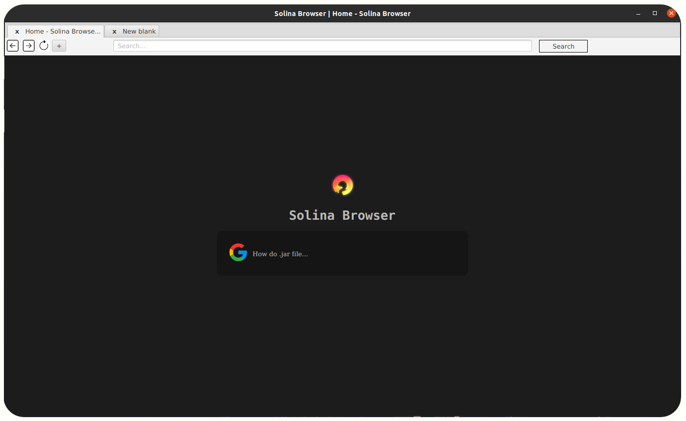

# Solina Browser
> Library: `JavaFX`

> #### After open project, maven install dependencies automatically.

**<center>Solina Browser UI</center>**

# Download Solina Browser
got to release section and download **solina-browser-`version`.deb**,

### requirement: java 

Set `JAVA_HOME=/your_java_path` in `/etc/environment` <br />
or install jre with.

```bash
sudo apt install openjdk-17-jre
```

> Note: if java is installed, and you don't know java path,
> use <br /> ``` which java```

# Install
here, current directory is location of solina-browser-2.0.1.deb file

```bash
sudo dpkg -i ./solina-browser-2.0.1.deb
```

Finally,  check this in **applications launcher** or use command 
`solina-browser`

## Features
* new tab link event.
* Manage download.
* Possibility to add extension.

